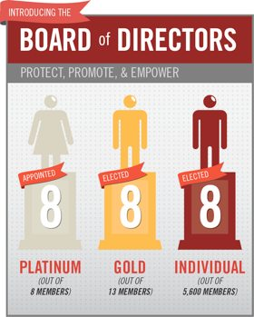
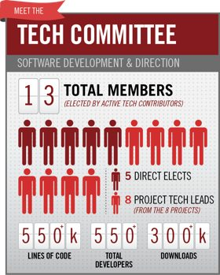
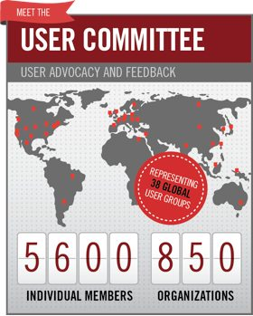

!SLIDE

* Lancée le 09/2012
* 10M$ au lancement
* 6M$ / an

!SLIDE

http://wiki.openstack.org/Governance/Foundation

!SLIDE
# Membres Platinum
500k$ / an

AT&T / Canonical / HP / IBM / Nebula / Rackspace / Red Hat, Inc. / SUSE

!SLIDE
# Membres Gold
CA * .025% (min 50k$ / max 200k$)

CCAT / Cisco / Cloudscaling / Dell / DreamHost / eNovance / Intel / Mirantis / Morphlabs / NEC / NetApp / Piston Cloud / VMware / Yahoo!

!SLIDE
# Sponsors Corporate
25k$/year

Alcatel Lucent / Brocade / Bull / Cloudwatt / EMC / Gale Technologies / Gridcentric / Hortonworks / Huawei / Internap / Juniper Networks / KIO Networks /Metacloud / Nexenta / Nimbula / PayPal / RightScale / RiverMeadow Software / Smartscale Systems / SwiftStack Inc / Transcend  Computing / Xemeti 

!SLIDE
# Sponsors Startup
10K$/year
