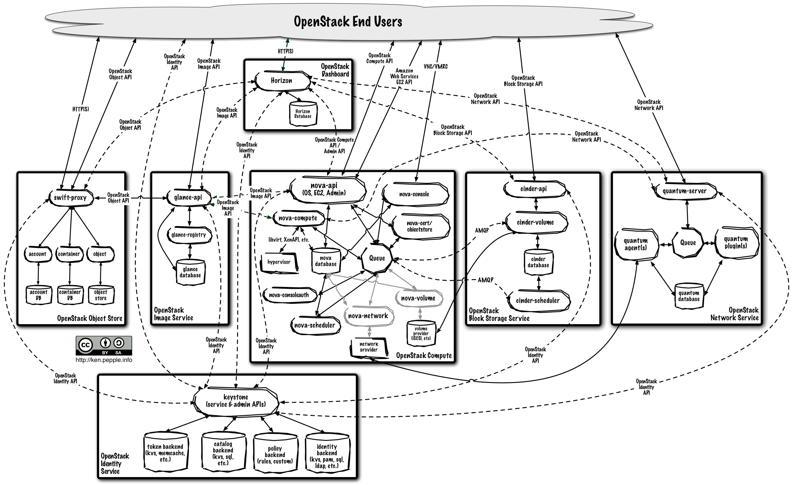

!SLIDE
# Horizon

Interface graphique pour gérer ses VMs.

* Application Django qui fournit une interface d'administration
* Base de données pour quelques données

!SLIDE full

!SLIDE full

!SLIDE full

