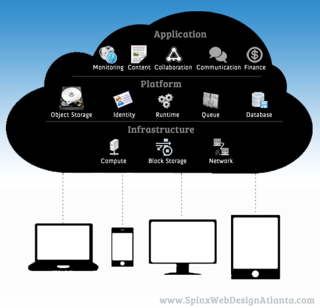

!SLIDE
# Rappel Cloud #

!SLIDE
# Caractéristiques (NIST)
1. On-demand self-service
2. Broad network access
3. Resource pooling
4. Rapid elasticity
5. Measured service

!SLIDE
# AAS (As a Service) #

Retour aux années 50 :)

- IaaS = infrastructure
- PaaS = platform
- SaaS = software
- NaaS = network
- DaaS = data
- STaaS = storage
- DBaas = database

!SLIDE full

!SLIDE
# Et Amazon ?

!SLIDE
# Ma recherche #

Je voulais :

- mixer cloud privé / cloud public (hybride)
- maitriser la techno

!SLIDE
# Pourquoi OpenStack ? #

* Logiciel Libre (licence Apache 2.0)
* Fondation OpenStack (argent, événement)
* Choix dans le prestataire
* Couche basse connue (Linux, libvirt, MySQL, KVM, OpenVSwitch, etc)
* Listes de diffusion actives
* API
* Documentation
* Python :)

!SLIDE
# Une démarche Libre #

Avoir une base commune Libre (Logiciel Libre, Internet)

!SLIDE
# Concurrents OpenStack #

- Propriétaire (Amazon AWS, VMWare vCloud)
- Libre (OpenNebula, CloudStack, Eucalyptus)

!SLIDE
# Pré-requis obligatoire #

- Linux (Ubuntu / RedHat)
- Virtualisation (KVM + Libvirt / Xen, image)

!SLIDE
# Pré-requis utile #

- Gestion de configuration (Puppet, Chef, Salt, etc)
- Scripting
- Python

!SLIDE
# Histoire OpenStack #

Initialement, fusion entre Rackspace Cloud File et Nasa NovaCC

!SLIDE
# Historique #

- 03/2010 : Décision de Rackspace d'ouvrir Rackspace Cloud File
- 04/2010 : Décision de la NASA d'ouvrir NovaCC
- 05/2010 : Création d'OpenStack
- 10/2010 : Austin (Nova, Swift)
- 02/2011 : Bexar (Nova, Swift, Glance)
- 04/2011 : Cactus (Nova, Swift, Glance)
- 10/2011 : Diablo (Nova, Swift, Glance)
- 04/2012 : Essex (Nova, Swift, Glance, Horizon, Keystone)
- 11/2012 : Folsom (Nova, Swift, Glance, Horizon, Keystone, Quantum, Cinder)
- 04/2013 : Grizzly (Nova, Swift, Glance, Horizon, Keystone, Quantum, Cinder, Ceilometer, Heat)

!SLIDE

* Cycle de release actuel : 6 mois
* 200+ développeurs / 55 sociétés
