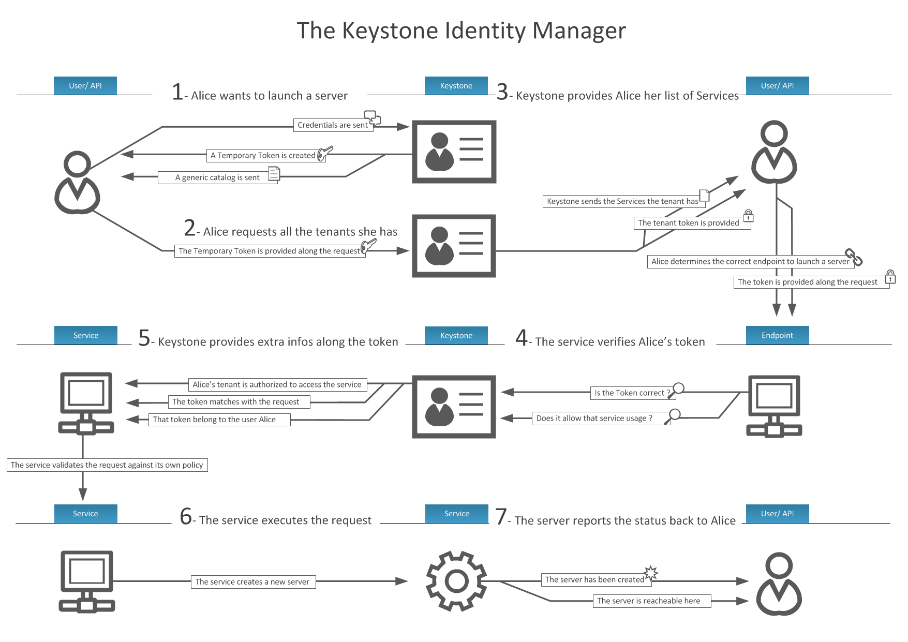

!SLIDE
# Keystone

Gestion unifiée des identités :

* utilisateurs
* tenants
* rôles
* métadonnées

!SLIDE full

!SLIDE full

!SLIDE
# Token

* Un texte arbitraire utilisé comme ressource d'accés.
* Chaque token à un scope qui décrit les ressources qui sont accessibles.
* Un token est révocable.

!SLIDE

!SLIDE
# Service

Catalogue de service (Endpoint registry)

Politique des services (rule-based authorization engine)

!SLIDE
# Backend

Configurable pour chaque service :

* MySQL
* LDAP
* Active Directory

!SLIDE
# Notion utilisateur

Réprésentation digitale d'une personne, un système ou un service. 

!SLIDE
# Notion credentials

Données qui représente un utilisateur et qui prouve son identité.

Exemples : 

- Login / mot de passe
- Login / API key
- Token

!SLIDE
# Notion rôle

Ensemble de droits qui permet un nombre spécifique d'opérations.

!SLIDE
# Notion tenant

"Conteneur", une collection de souscription à des services ou des ressources.
