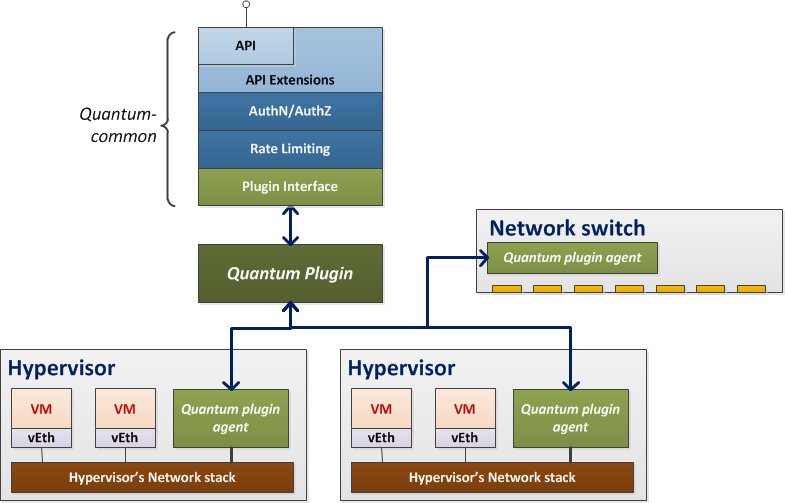
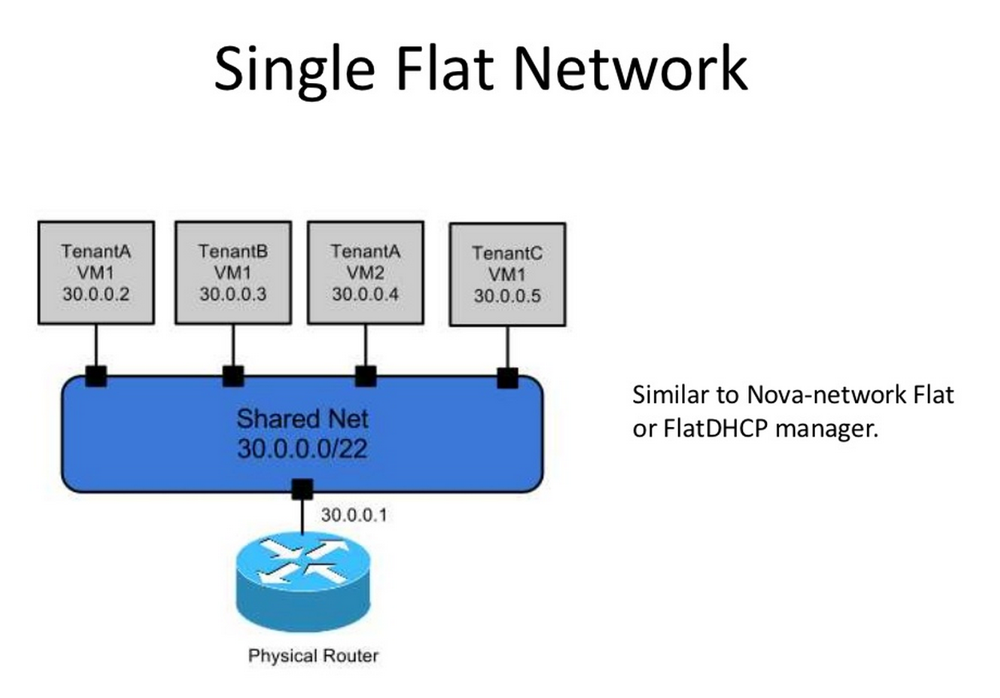
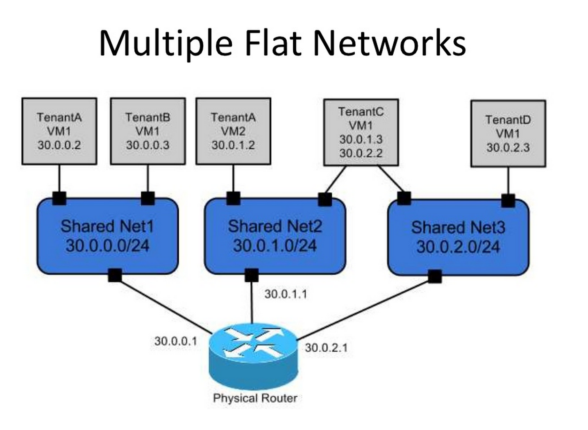
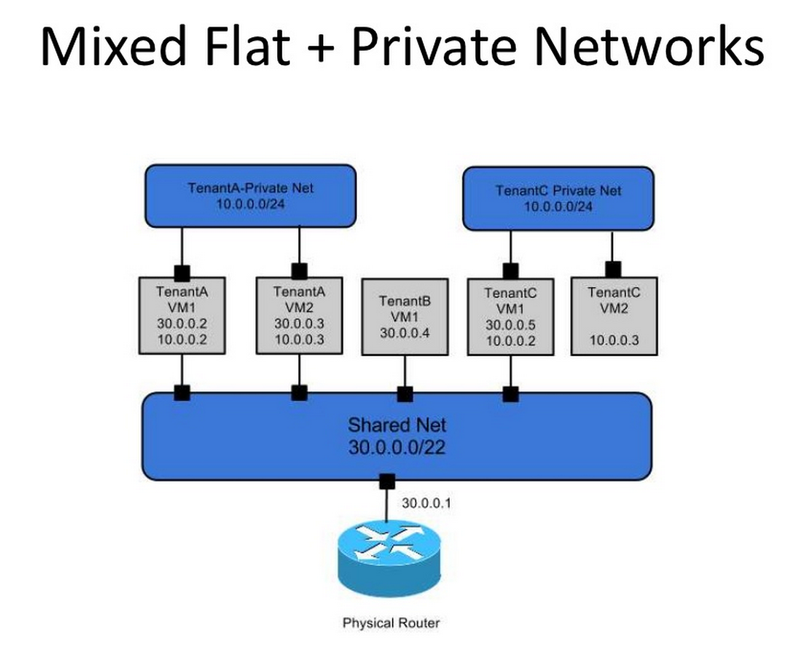
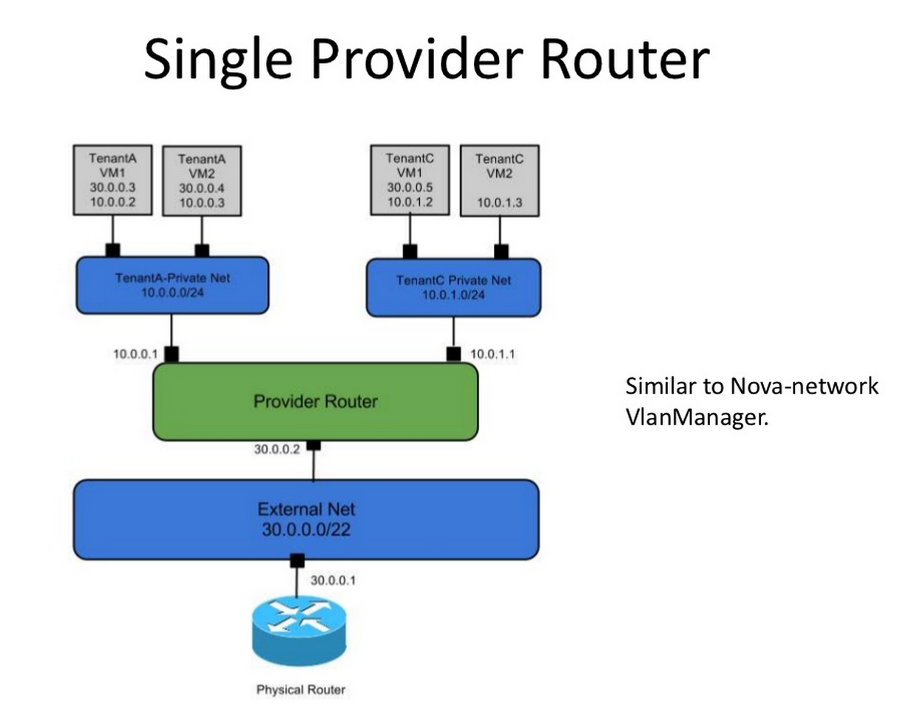
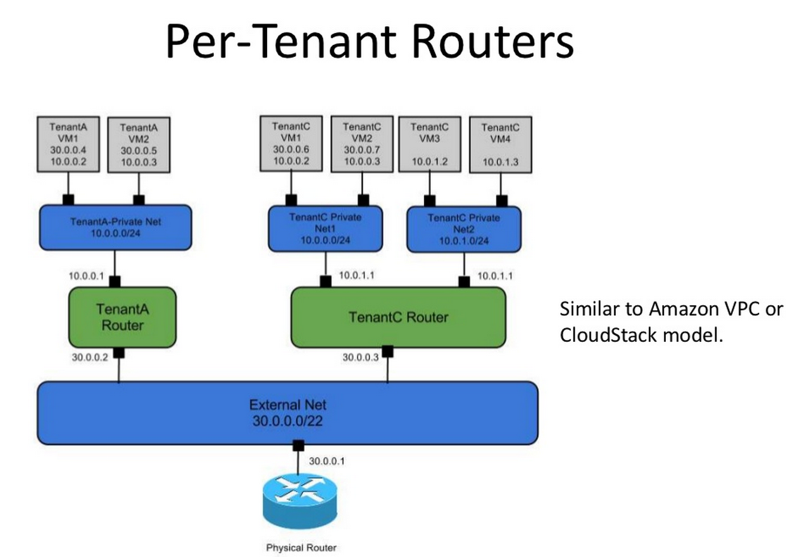

!SLIDE
# Quantum

API multi-tenant de gestion réseau :

- Founit une interface pour gérer les réseaux virtuels
- Permet de définir une topologie "riche"

!SLIDE full

!SLIDE full

!SLIDE
# Agnostique

Découple la vue logique (tenant) de la vue physique (fournisseur).

=> Agnostique de la technologie / SDN de virtualisation réseau

!SLIDE full

!SLIDE
# Extension API

* Extension générique (QOS)
* Extension spécifique

!SLIDE
# Extension API

"provider network"

réseau Quantum L2 <=> VLAN

!SLIDE
# Extension API

"L3 routers"

Routeur L3 basique pour relier les réseaux L2

Gateway avec des réseaux externes

!SLIDE full

!SLIDE full

!SLIDE full

!SLIDE full

!SLIDE full

!SLIDE
# Support Horizon

- Création / suppresion de réseau
- Choix du réseau pour les VMs

!SLIDE
# plugins supportés
        
- Open vSwitch Plugin
- Cisco UCS/Nexus Plugin
- Linux Bridge Plugin
- Nicira Network Virtualization Platform (NVP) Plugin
- Ryu OpenFlow Controller Plugin
- NEC OpenFlow Plugin
- Big Switch OpenFlow Controller Plugin
- Cloudbase Hyper-V Plugin 

!SLIDE
# plugins extérieurs

- Floodlight OpenFlow Controller Plugin
- MidoNet Plugin
- Extreme Networks Plugin
- Ruijie Networks Plugin
- Brocade Quantum Plugin Brocade Quantum Plugin
- Mellanox Plugin Mellanox Plugin 

!SLIDE
# Quantum manager

Gère les demandes de nova-network

Gestion du DHCP,
